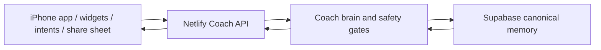

# iOS Native Coach App Implementation Plan

Date: 2026-05-14
Owner: Todd / Codex
Working name: Todd Coach

## Executive Decision

Build a native iPhone app as a command, capture, and message surface for the existing Personal Coach. Do not rebuild the dashboard as the primary experience. Do not replace the current coach brain. The existing Netlify API and Supabase memory remain canonical; the iOS app makes them easier to use, harder to forget, and more available from the places Todd already lives: Lock Screen, widgets, Shortcuts, Siri, Share Sheet, camera, Photos, and eventually Apple Health.

The 2x-better version is not "a prettier dashboard." It is a friction reducer:

- Ask Coach from anywhere.
- Capture screenshots, food, BP, body, recovery, activity, strength, doctor notes, and workout feedback without the brittle iCloud-folder detour.
- Put the next useful coach action in front of Todd at the right time.
- Send short coaching updates that stand alone, with the dashboard demoted to diagnostics.
- Preserve the safety rules, source hierarchy, hip constraints, nutrition targets, World Gym/Motra context, and memory-aware workout behavior already built into the backend.

## Why Not Build Everything At Once

We should build the full architecture now, but ship it in vertical slices. The reason is not caution for its own sake; it is quality control. The useful app depends on several separate risk areas:

- Private API auth and secure local storage.
- Structured health and workout data capture.
- App Intents, widgets, and Shortcuts behavior.
- Share Extension image intake.
- Optional HealthKit read/write permissions.
- Later Watch app or Live Activity surfaces.

If all of that lands at once, basic daily usefulness gets buried under integration debugging. The better approach is to make the app useful on day one, then expand each native surface after the core loop is verified.

## Current System Facts

Xcode:

- Xcode 26.5 is installed.
- The active developer path points to `/Applications/Xcode.app/Contents/Developer`.
- The iOS 26.5 Simulator runtime is installed.
- Available simulator devices include iPhone 17, iPhone 17 Pro, iPhone 17 Pro Max, iPhone 17e, iPhone Air, and current iPad models.

Coach backend:

- Canonical memory is Supabase.
- Public API base is `https://todd-personal-coach.netlify.app`.
- All coach actions require the `x-coach-secret` header.
- Existing coach endpoints:
  - `GET /api/coach/dashboard`
  - `POST /api/coach/message`
  - `POST /api/coach/brief`
  - `POST /api/coach/workout`
  - `POST /api/coach/nutrition-closeout`
  - `POST /api/coach/post-workout`
  - `POST /api/coach/feedback`
  - `POST /api/coach/intake`
- Supported structured intake types:
  - `bp`
  - `food`
  - `body`
  - `recovery`
  - `activity`
  - `strength`
  - `workout`
  - `doctor`
  - `note`

Coach behavior that must carry into the app:

- Garmin Nutrition is food/calorie/macro support, not the final workout programmer.
- Garmin Fenix 8 is the primary integrated training/recovery system when worn overnight and during training.
- Rack/Motra is strength-log source of truth for completed sets, reps, loads, exercise history, and session details.
- Oura is optional/secondary sleep-recovery fallback when Garmin sleep/recovery data is stale, missing, or unreliable.
- Apple Health is supporting cross-check/data-bus evidence only.
- Soundcore Sleep A30 is sleep aid/noise/snore support only, not recovery authority.
- Medical/safety overrides beat app scores.
- Current training shape is Monday/Wednesday/Friday strength, Tuesday/Thursday goal-support, daily walk, Sunday formal training off.
- Strength work respects the right-hip impingement / labral-risk layer, HR cap, anti-session-creep rules, and World Gym floor constraints.
- Workout responses must keep exact Motra names where known.

Apple platform guidance checked:

- App Intents expose app actions to Siri, Shortcuts, Spotlight, widgets, and system surfaces.
- Widgets and Live Activities can use App Intents for direct button/toggle actions without opening the app.
- HealthKit requires user permission and should be treated as an optional, privacy-gated integration.
- HKWorkoutBuilder can write workouts later, but this should not be phase-one because Rack/Motra remains the real strength-log source and Apple Health is supporting evidence only.

Reference links:

- https://developer.apple.com/documentation/appintents
- https://developer.apple.com/documentation/AppIntents/AppShortcutsProvider
- https://developer.apple.com/documentation/widgetkit/adding-interactivity-to-widgets-and-live-activities
- https://developer.apple.com/documentation/healthkit
- https://developer.apple.com/documentation/healthkit/hkworkoutbuilder

## Product Shape

### First Screen

The app opens directly into today, not a landing page.

Top area:

- Readiness call: green / amber / red / recovery-only.
- Next useful action: brief, workout, nutrition closeout, post-workout debrief, or data capture.
- Short coach reply preview.

Main actions:

- Morning Brief
- Build Workout
- Nutrition Closeout
- Post-Workout Debrief
- Ask Coach
- Capture Data

Secondary context:

- Today schedule.
- Risk flags.
- Nutrition target status.
- Latest BP / body / recovery / activity source timestamps.
- Last coach decision.

### Navigation

Use a compact native tab structure:

- Today
- Chat
- Capture
- History
- Settings

This keeps the app usable as a real daily tool instead of turning it into a document archive.

## Architecture

### Targets

Phase-one Xcode project:

- `ToddCoachApp`
  - SwiftUI app.
  - Owns screens, settings, secure secret storage, API calls, and local cache.
- `ToddCoachIntents`
  - App Intents available to Shortcuts, Siri, Spotlight, widgets, and Action button flows.
- `ToddCoachWidgets`
  - Home Screen / Lock Screen widgets for brief, workout, nutrition closeout, and capture shortcuts.

Phase-two target:

- `ToddCoachShareExtension`
  - Accepts images/text from Photos, screenshots, files, Bevel/Oura/Motra screens, and doctor PDFs/images.

Phase-three optional target:

- `ToddCoachWatch`
  - Only after iPhone capture and widgets are stable.

### Local Project Layout

Proposed folder:

```text
ios/ToddCoach/
  ToddCoach.xcodeproj
  ToddCoachApp/
    App/
    Screens/
    Components/
    Services/
    Models/
    Persistence/
    Security/
    Resources/
  ToddCoachIntents/
  ToddCoachWidgets/
  ToddCoachShareExtension/
  ToddCoachTests/
```

### Data Flow

The app should not talk directly to Supabase. It talks to the Netlify coach API only.



### Security

Store the coach API secret in Keychain.

Rules:

- Never hard-code `COACH_API_SECRET`.
- Never write the secret into logs.
- Settings screen allows paste/update/remove.
- API client refuses requests until the secret exists.
- Widget and intent targets use a shared Keychain access group or a main-app mediated service, depending on what Xcode signing supports cleanly.
- Debug logs redact auth headers and payload fields that might include medical notes.

### Local Cache

Use a small local cache for speed and offline friendliness:

- Last dashboard summary.
- Last few coach replies.
- Pending capture drafts.
- Last successful sync timestamp.
- Last failed request and retry state.

Use SwiftData only if it stays simple. A lightweight JSON cache is acceptable for phase one because Supabase remains canonical.

## API Client Contract

Create one `CoachAPIClient` service with typed methods:

- `fetchDashboard(full: Bool = false)`
- `sendMessage(text:intent:channel:raw:)`
- `morningBrief(text:raw:)`
- `buildWorkout(text:raw:)`
- `nutritionCloseout(text:raw:)`
- `postWorkout(text:raw:)`
- `submitFeedback(...)`
- `submitIntake(...)`

Default channels:

- `ios-app`
- `ios-widget`
- `ios-intent`
- `ios-share-extension`
- `ios-camera-capture`

Handle these response states explicitly:

- Missing secret.
- Offline.
- API timeout.
- 401 invalid secret.
- 404 missing profile.
- Backend validation error.
- Successful response with coach `reply`.

## App Intents

Phase-one intents:

- `MorningBriefIntent`
  - Calls `/api/coach/brief`.
  - Returns coach reply text.
- `BuildWorkoutIntent`
  - Calls `/api/coach/workout`.
  - Opens app when a structured workout plan is returned.
- `NutritionCloseoutIntent`
  - Calls `/api/coach/nutrition-closeout`.
- `PostWorkoutDebriefIntent`
  - Accepts a text note and calls `/api/coach/post-workout`.
- `FastCoachNoteIntent`
  - Accepts text and calls `/api/coach/message` with `general`.
- `LogBloodPressureIntent`
  - Parameters: systolic, diastolic, heart rate, note.
  - Calls `/api/coach/intake` with `type: "bp"`.

Phase-two intents:

- `CaptureRecoveryIntent`
- `CaptureNutritionTotalsIntent`
- `CaptureBodyMetricsIntent`
- `ToggleTravelModeIntent` or `AskTravelWorkoutIntent`
- `AskCoachAboutScreenshotIntent`

App shortcuts should include natural phrases:

- "Coach brief"
- "Build my workout"
- "Coach nutrition closeout"
- "Log blood pressure"
- "Tell coach"
- "Post workout debrief"

## Widgets

Phase one:

- Small widget: readiness + one next action.
- Medium widget: readiness, nutrition constraint, and buttons for brief/workout/closeout.
- Lock Screen accessory: readiness color and next action.

Rules:

- Widget buttons should perform real actions through App Intents, not merely open the app.
- If the action fails, widget state should show stale/offline/needs-auth rather than pretending everything is fine.
- Do not put sensitive medical detail on the Lock Screen.

Phase two:

- Capture widget with quick buttons: BP, food, body, recovery, workout note.
- Smart Stack relevance around morning, pre-gym, evening closeout.

## Capture Design

### Manual Capture

Capture screen sections:

- Blood Pressure
- Food / Nutrition Totals
- Body Metrics
- Recovery / Sleep
- Activity
- Strength Session
- Workout Feedback
- Doctor Note
- General Coach Note

Each capture form should:

- Default date to Asia/Taipei today.
- Show required fields clearly.
- Save as draft locally if offline.
- Submit to `/api/coach/intake`.
- Show the exact stored type after success.

### Screenshot / Photo Capture

Phase one:

- Camera/photo picker lets Todd attach an image with a chosen type and short note.
- If backend image analysis is not yet available from the iOS endpoint, app stores a note and points Todd to current screenshot intake as a fallback.

Phase two:

- Add native image upload endpoint or multipart intake endpoint.
- Move the current vision extraction behavior behind the API so the app can submit screenshots directly.
- Keep source labels strict: Bevel, Oura, Apple Fitness/Apple Watch, Motra/Train Fitness, Ocare3, Hume, doctor/hospital documents, Unknown.

### Share Extension

The Share Extension should be the breakthrough feature.

Supported input:

- Screenshots from Photos.
- Images from Files.
- Text selected from other apps.
- Doctor PDFs/images if technically practical.

Flow:

1. Share to Todd Coach.
2. Choose source/type if not obvious.
3. Add optional note.
4. Submit as intake.
5. Show success or saved-draft state.

This replaces the brittle iCloud folder workflow without removing it immediately.

## HealthKit Strategy

Do not make the native iOS app HealthKit UI phase one. The backend PR 1 contract
now exists separately: native clients may post already-summarized daily HealthKit
rows to `/api/coach/apple-health-daily` with `x-coach-secret`.

Reason:

- Garmin, Rack/Motra, Oura, Apple Health, Soundcore, Hume, Ocare3, and doctor notes already have source-specific meaning in the coach system.
- HealthKit can supply useful Apple Watch activity and body samples, but it can also blur source meaning if we import too much too soon.
- HealthKit permissions, privacy strings, and data review deserve a separate, careful pass.
- The backend stores daily summaries in `apple_health_daily_summaries` and sync attempts in `apple_health_sync_runs`; it does not upload raw HealthKit samples or overwrite Oura/Garmin/Rack lanes.

Phase-three HealthKit reads:

- Steps.
- Active energy.
- Heart-rate summaries.
- Workouts from Apple Fitness.
- Body mass if already in Health.

Phase-four HealthKit writes:

- Possibly write a coach-built workout only if it does not conflict with Motra.
- Possibly write BP if Todd wants Health app consolidation.

## Notifications

Phase one should avoid noisy notifications.

Useful notification candidates:

- Evening nutrition closeout if no food data today.
- Post-workout debrief after a Motra/Apple workout is detected later.
- BP reminder during doctor-requested measurement windows.
- Gentle travel-mode check when calendar/location indicates travel later.

Notification rules:

- Must be explainable and sparse.
- Must allow quiet hours.
- Must distinguish "reminder" from "coach decision."
- No medical alarm language unless a doctor-defined threshold is explicitly configured.

## Implementation Phases

### Phase 0: Readiness And Xcode Setup

Done / known:

- Xcode installed.
- Xcode selected as active developer toolchain.
- iOS 26.5 Simulator runtime installed.
- Bootable iPhone simulator devices are available.

Needed before simulator testing:

- Create the native Xcode project.
- Create or confirm Apple developer team/signing for physical-device testing.

Deliverables:

- This implementation plan.
- Xcode setup checklist.

Verification:

- `xcodebuild -version` reports installed Xcode.
- `xcrun simctl list runtimes` shows an iOS runtime.
- A blank SwiftUI app can build and run on the iPhone simulator or Todd's iPhone.

### Phase 1: Useful Native Shell

Build:

- SwiftUI project.
- Today screen.
- Settings screen with API base and Keychain secret.
- Coach API client.
- Daily call fetch for summary context; full dashboard data stays behind status/debug views.
- Buttons for brief, workout, nutrition closeout, post-workout debrief.
- Chat-like Ask Coach screen.
- Basic local cache and clear error states.

Verification:

- App launches.
- Secret can be stored, updated, removed.
- Today opens to a coach call and next action, not a metrics panel.
- Each main action returns a coach reply.
- Invalid secret shows 401 state.
- Offline mode shows the cached last-known coach call and does not lose typed text.

### Phase 2: App Intents And Widgets

Build:

- Morning brief intent.
- Build workout intent.
- Nutrition closeout intent.
- Post-workout debrief intent.
- Fast coach note intent.
- Log BP intent.
- AppShortcutsProvider phrases.
- Small and medium widgets.
- Lock Screen accessory widget.

Verification:

- Actions appear in Shortcuts.
- Siri/Shortcuts can run the main intents.
- Widget buttons perform real API calls.
- Failed requests are visible and recoverable.
- No secret appears in logs or UI.

### Phase 3: Structured Capture

Build:

- Capture tab with forms for all supported intake types.
- Draft queue for offline/unfinished submissions.
- Local validation matching backend requirements.
- Success screen that states the stored intake type.

Verification:

- BP requires systolic and diastolic.
- Food totals accept calories/protein/carbs/fat/fiber/sodium.
- Body metrics sanitize obvious wrong units before submit.
- Workout feedback updates coach adaptation through existing backend.
- Doctor note captures topic, guidance, and training impact.

### Phase 4: Share Extension And Image Intake

Build:

- Share Extension.
- Image/text intake flow.
- New backend upload endpoint if required.
- Vision extraction route reuse from current screenshot watcher.
- De-duplication and source-family naming consistent with current backend.

Verification:

- Share screenshot from Photos to Todd Coach.
- Submit Bevel screenshot.
- Submit Oura screenshot.
- Submit Motra screenshot.
- Submit doctor image/PDF if supported.
- Confirm Supabase rows and coach message trail are created.
- Confirm fallback draft survives failed upload.

### Phase 5: HealthKit And Apple Watch

Build only after phases 1-4 are stable:

- HealthKit permission request screen.
- Read-only Apple Fitness/Watch daily-summary import using the existing `/api/coach/apple-health-daily` backend contract.
- Optional watch companion for post-workout feedback or quick coach note.
- Optional workout Live Activity if it solves a real gym problem.

Verification:

- Permissions can be granted/revoked.
- No data imports without explicit permission.
- Imported activity is source-labeled and does not overwrite Oura, Garmin, Garmin Nutrition, Rack, or Motra meaning.

## Quality Gates

No phase is complete until:

- Build passes.
- Main happy path is tested.
- At least one failure path is tested.
- Secret handling is checked.
- UI text fits on small and large iPhone sizes.
- Cached/offline behavior is checked.
- The coach reply is logged in the existing backend where appropriate.
- The change does not weaken the existing iPhone Shortcuts or screenshot watcher fallback.

## Testing Matrix

Devices:

- iPhone 17 Pro simulator.
- Smaller and larger iPhone simulator variants.
- Todd's physical iPhone if signing is available.

Screen sizes:

- Current iPhone Pro-sized simulator.
- Smaller iPhone simulator.
- Large iPhone simulator.

Network states:

- Online.
- Offline.
- Slow response.
- Invalid secret.

Coach states:

- Strength day.
- Non-strength day.
- Red readiness.
- Travel mode.
- Missing fresh data.
- Post-workout feedback.

Privacy checks:

- No secret printed.
- Lock Screen widget hides sensitive detail.
- HealthKit has clear permission copy before any read.

## Risks And Mitigations

Risk: The app becomes another dashboard instead of a behavior tool.

Mitigation: First screen is message/action-first. Dashboard details are diagnostics, and `status` is an explicit command rather than the default view.

Risk: Native capture creates duplicate or mislabeled data.

Mitigation: Keep source labels strict and reuse backend idempotency/merge behavior.

Risk: HealthKit muddies source hierarchy.

Mitigation: Defer HealthKit and import only narrow Apple Watch/Apple Fitness facts with source labels.

Risk: Secret sharing across widgets/intents gets messy.

Mitigation: Start with main app and App Intents. Add widget actions only after Keychain access group behavior is verified.

Risk: The screenshot watcher and native image intake diverge.

Mitigation: Move extraction logic behind a backend endpoint before making native image intake primary.

Risk: The app encourages overtraining by making workout generation too easy.

Mitigation: The backend remains the gatekeeper, and the UI should surface readiness/risk flags before workout details.

## Open Questions Before Coding

These are small enough that we can choose defaults, but they should be confirmed before TestFlight or daily use:

- App name: `Todd Coach`, `Coach`, or `Personal Coach`.
- Bundle identifier: likely `com.toddblackhurst.toddcoach`.
- Whether Todd wants simulator-first testing or early physical iPhone testing.
- Whether the API secret should be entered manually once or delivered through a local config during development.
- Whether widgets should show only readiness/action or also nutrition totals.

## Recommended Next Move

Start Phase 1 immediately in the iPhone simulator. Add physical-device testing once signing is confirmed.

First implementation milestone:

1. Create `ios/ToddCoach`.
2. Build the SwiftUI shell with Today, Chat, Capture, History, Settings.
3. Implement secure API setup.
4. Connect coach call, brief, workout, nutrition closeout, post-workout, message, and status-on-request.
5. Verify with one successful API call and one invalid-secret failure.

That gives Todd a real app quickly while preserving the deeper architecture for widgets, App Intents, Share Sheet capture, HealthKit, and Watch.
